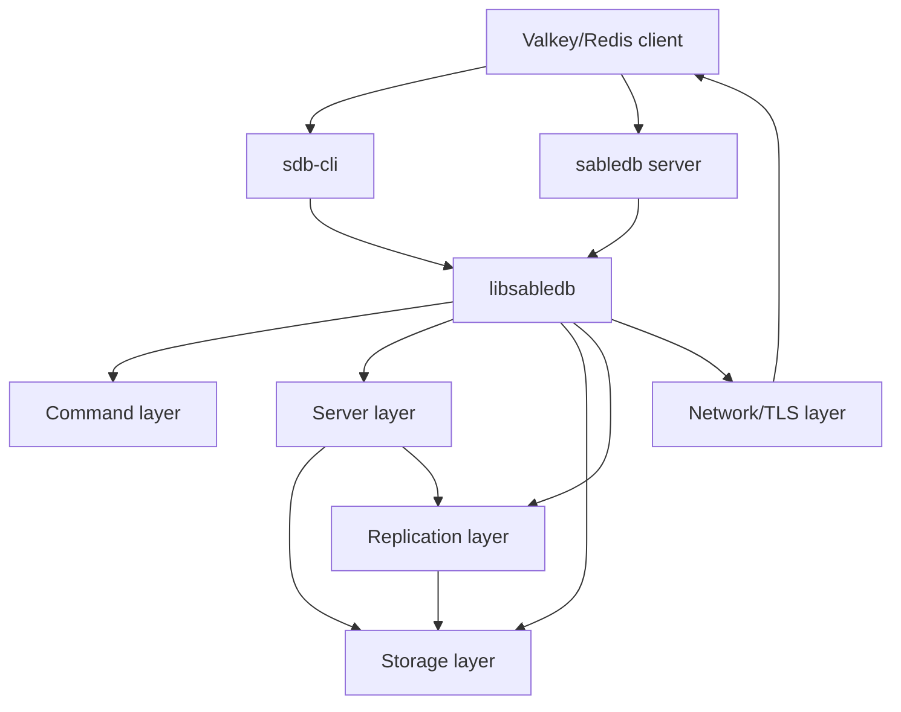
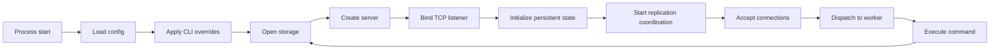
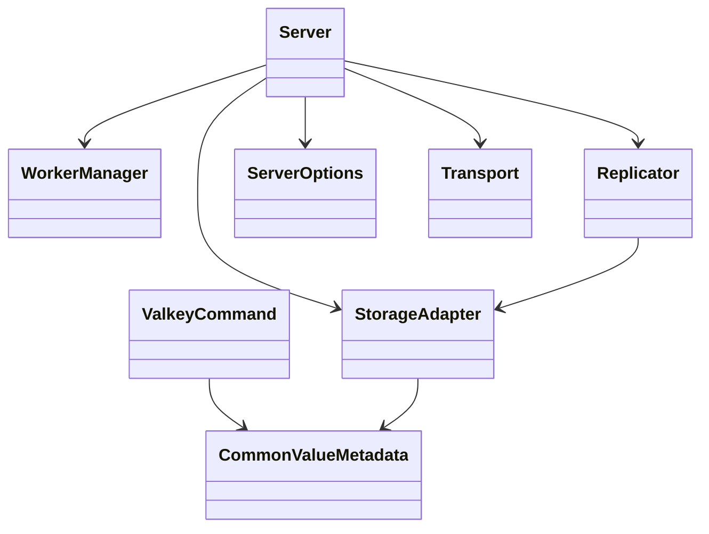

# Architecture

## Overview
SableDB is organized as a Rust workspace with a shared library crate and multiple binaries. The architecture centers on a storage-backed server that accepts Valkey-compatible client traffic, executes commands through typed command handlers, and persists data through a RocksDB-based storage abstraction.

## Architectural layers

## Core design boundaries
- **Command layer**: parses and validates Valkey-style commands and dispatches them to subsystem handlers.
- **Server layer**: owns process state, worker allocation, connection acceptance, cron activity, and shutdown handling.
- **Storage layer**: abstracts persistence behind a common adapter and provides typed databases for value families.
- **Replication layer**: coordinates node-to-node communication, persistent cluster state, and update propagation.
- **Network/TLS layer**: manages socket behavior and secure transport.

## Design patterns observed
- **Facade-style public API**: `libsabledb` re-exports major types so binaries can depend on one crate surface.
- **Modular subsystem split**: commands, storage, replication, server, metadata, and utilities are isolated as modules.
- **Configuration-driven runtime**: INI-backed `ServerOptions` controls server, RocksDB, client limits, cron behavior, and replication settings.
- **Worker dispatch model**: incoming sockets are distributed to worker threads rather than handled inline in the accept loop.
- **Macro-assisted validation**: macros handle repetitive argument validation, type checks, and serialized response creation.

## Runtime structure

## Important architectural characteristics
- The server can operate in standalone or cluster/replication-aware modes depending on configuration.
- Storage is not embedded directly into business logic; it is accessed through adapter and trait layers.
- The client binary uses the Redis protocol, indicating external compatibility as a key design goal.
- Configuration and runtime state are both significant: startup reads configuration files, then applies command-line overrides.
- Persistence and replication are coupled through storage updates and node state management.

## Mermaid view of major subsystem relationships

## Notes
- The codebase is strongly backend-oriented; no front-end application architecture was observed.
- Detailed type maps and workflow sequences are documented in `components.md`, `data_models.md`, and `workflows.md`.
