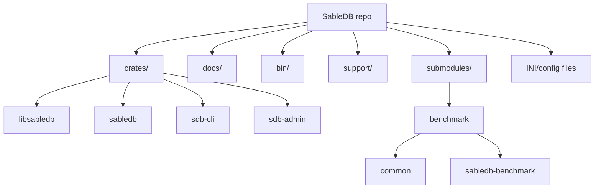
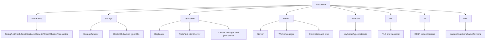

# Codebase Information

## Scope
- Repository: SableDB
- Primary language: Rust
- Support tooling: Markdown, INI, Bash, Batch, Python, TypeScript/Bun metadata tooling
- Non-source/generated artifacts present in repo: build output under `target/` and runtime/history files

## Top-level layout

## Package and component map
- `crates/libsabledb`: core library; exposes command handling, storage, replication, server runtime, networking, metadata, and utilities.
- `crates/sabledb`: database server binary; loads config, opens storage, starts worker pool and TCP listener.
- `crates/sdb-cli`: interactive client binary; connects over Redis/Valkey protocol and executes commands.
- `crates/sdb-admin`: admin binary; currently exposes upgrade operations.
- `submodules/benchmark`: benchmark workspace and shared utilities.

## Architectural patterns observed
- Workspace-based monorepo with a central library crate consumed by multiple binaries.
- Clear separation between command parsing, storage, replication, server execution, and network transport.
- Configuration is loaded from INI files and can be overridden by command-line arguments.
- Runtime behavior relies on worker dispatching and shared state wrapped in synchronization primitives.
- Extensive macro-based helper layer for repetitive command validation and serialization tasks.

## Key runtime entry points
- `crates/sabledb/src/main.rs`: server bootstrap.
- `crates/sdb-cli/src/main.rs`: interactive command-line client.
- `crates/sdb-admin/src/main.rs`: administration entry point.
- `crates/libsabledb/src/lib.rs`: public API surface for the library.

## Supported languages observed
- Rust: primary implementation language.
- Markdown: documentation, command metadata, operational guides.
- INI: runtime configuration.
- Bash/Batch: scripts and environment setup.
- Python: auxiliary helper script(s).
- TypeScript/Bun: compatibility-check tooling in support submodule.

## Unsupported or not observed in source
- No evidence in the inspected files of Go, Java, C#, JavaScript application runtime, or Python application server code.
- No front-end framework source was observed in the inspected paths.

## Technology stack
- Rust 2021 edition
- Tokio async runtime
- Clap for CLI parsing
- Tracing / tracing-subscriber for logging
- RocksDB for storage engine integration
- Redis client/protocol compatibility layer
- Rustls/TLS support
- Crossbeam, DashMap, Rayon-like concurrency primitives via ecosystem crates

## External dependency themes
- Storage: `rocksdb`, `sled`
- Networking/TLS: `tokio`, `rustls`, `tokio-rustls`, `rustls-pemfile`
- CLI / parsing: `clap`, `ini`, `redis`, `rustyline`
- Concurrency / collections: `crossbeam`, `dashmap`, `rclite`
- Serialization / encoding: `serde`, `serde_json`, `bincode`, `bytes`
- Utilities: `uuid`, `crc16`, `flate2`, `tar`, `wildmatch`, `num-*`, `strum`

## Main subsystems discovered
- Commands and protocol handling
- Storage adapters and type-specific databases
- Replication and cluster coordination
- Server process lifecycle and worker management
- I/O helpers for RESP and temporary files
- Metadata modeling for keys, expirations, and typed values
- Utilities for parsing, matching, backoff, timing, and locking

## Integration points
- TCP listener accepts client connections and hands them to workers.
- Storage adapter abstraction wraps RocksDB-backed persistence.
- Replication components synchronize updates between nodes.
- CLI client uses Redis protocol compatibility for interaction.
- Config files control server networking, storage, cron, and replication behavior.

## Hierarchical codebase map

## Notes on analysis limits
- This summary is based on top-level manifests and representative entry-point/module files.
- Deeper type-level APIs and per-command behavior require consultation of the generated documentation files in this directory.
