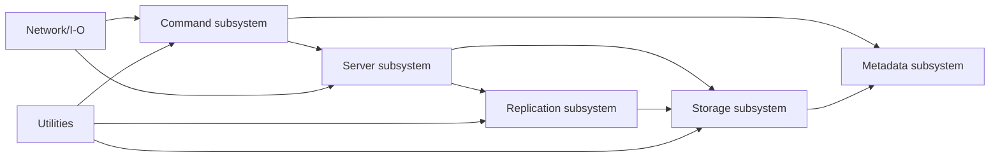

# Components

## Major workspace crates
- `libsabledb`: core library containing the server runtime, storage abstractions, replication system, protocol utilities, metadata models, and command implementations.
- `sabledb`: database server binary that bootstraps configuration, opens storage, and serves client connections.
- `sdb-cli`: command-line client for connecting to a running SableDB instance and issuing commands interactively or from files.
- `sdb-admin`: administrative binary for maintenance tasks such as upgrade operations.

## Core library subsystems

### Command subsystem
Responsibilities:
- Parse, validate, and execute Valkey-compatible commands.
- Organize commands by data type and behavior.
- Provide reusable command traits and helpers.

Representative modules:
- `commands::string_commands`
- `commands::list_commands`
- `commands::hash_commands`
- `commands::set_commands`
- `commands::zset_commands`
- `commands::transaction_commands`
- `commands::client_commands`
- `commands::cluster_commands`
- `commands::server_commands`
- `commands::commander`

### Storage subsystem
Responsibilities:
- Abstract persistence behind a storage adapter.
- Provide typed database helpers for strings, hashes, lists, sets, locks, and sorted sets.
- Support write caching, scanning, and storage limits.

Representative modules:
- `storage::storage_adapter`
- `storage::storage_rocksdb`
- `storage::storage_trait`
- `storage::string_db`
- `storage::hash_db`
- `storage::list_db`
- `storage::set_db`
- `storage::zset_db`
- `storage::lock_db`
- `storage::write_cache`

### Replication subsystem
Responsibilities:
- Manage node-to-node communication and cluster coordination.
- Track persistent replication state.
- Send storage updates and coordinate primary/replica behavior.

Representative modules:
- `replication::replicator`
- `replication::cluster_manager`
- `replication::client_replication_loop`
- `replication::node_talk_client`
- `replication::node_talk_server`
- `replication::persistence`
- `replication::replication_config`
- `replication::storage_updates`

### Server subsystem
Responsibilities:
- Load and maintain server configuration.
- Accept connections and assign them to workers.
- Track client state, node state, telemetry, and cron behavior.
- Handle shutdown and runtime coordination.

Representative modules:
- `server::server`
- `server::server_options`
- `server::worker_manager`
- `server::worker`
- `server::client`
- `server::client_state`
- `server::node_state`
- `server::cron_thread`
- `server::telemetry`
- `server::watchers`
- `server::slots`
- `server::error_codes`

### Metadata subsystem
Responsibilities:
- Model key metadata and value-family state.
- Support expiration, prefixing, and typed value bookkeeping.

Representative modules:
- `metadata::primary_key_metadata`
- `metadata::string_value_metadata`
- `metadata::value_metadata`
- `metadata::bookkeeping`
- `metadata::expiration`
- `metadata::hash_metadata`
- `metadata::list_metadata`
- `metadata::set_metadata`
- `metadata::zset_metadata`
- `metadata::lock_metadata`
- `metadata::keyprefix`
- `metadata::delete_range`

### Network and I/O subsystems
Responsibilities:
- Transport socket configuration.
- TLS-related handling.
- RESP parsing and response writing.

Representative modules:
- `net::transport`
- `net::tls`
- `io::resp_writer`
- `io::resp_response_parser_v2`
- `io::file_output_sink`
- `io::temp_file`

### Utilities subsystem
Responsibilities:
- Parsing, formatting, pattern matching, timers, backoff, file helpers, and synchronization helpers.

Representative modules:
- `utils::request_parser`
- `utils::resp_builder_v2`
- `utils::resp_response_parser_v2`
- `utils::pattern_matcher`
- `utils::simple_backoff`
- `utils::stopwatch`
- `utils::ticker`
- `utils::shard_locker`
- `utils::file_utils`

## Component interaction map

## Repository-specific utilities and scripts
- `bin/`: operational scripts and maintenance helpers.
- `conf.ini` and `server.ini`: baseline configuration examples.
- `tree.py`: repository-tree helper script.
- `support/compatibility_check`: compatibility reporting support tooling.
- `.github/workflows/rust.yml`: CI workflow for build, clippy, and tests.

## Component-level navigation advice
- Start in `server::server_options` and `server::server` for startup and runtime configuration questions.
- Start in `commands::mod` and the specific command-family modules for command semantics.
- Start in `storage::mod` and `storage::storage_adapter` for persistence questions.
- Start in `replication::mod` for cluster and replica behavior.
