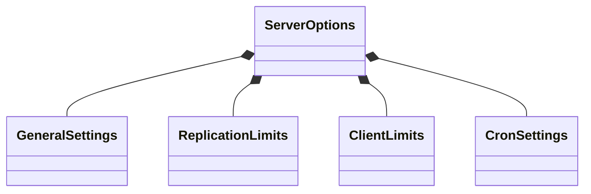
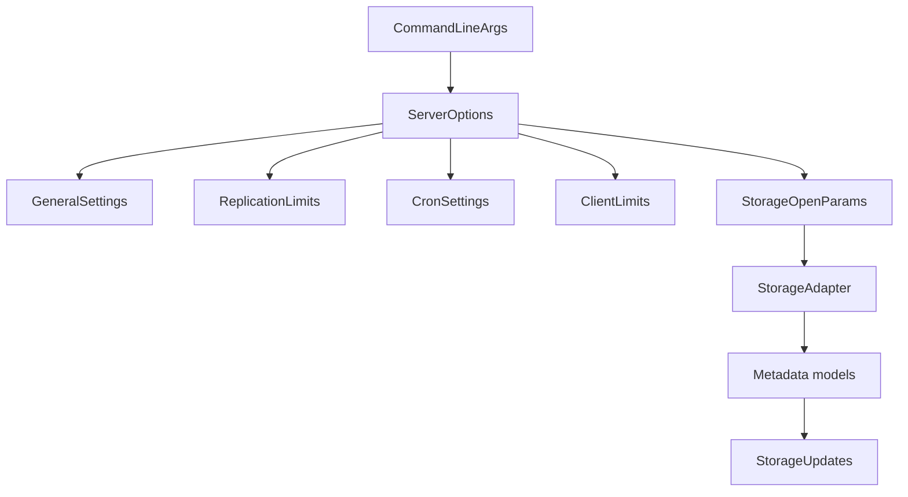

# Data Models

## Overview
The repository uses a small number of central configuration and state models that drive server behavior, storage setup, and replication.

## Configuration models

### `GeneralSettings`
Holds user-facing server configuration such as:
- public address
- private address
- optional cluster address
- worker count
- log level
- optional certificate and key paths
- optional configuration directory and log directory

### `ReplicationLimits`
Controls replication message sizing and update batching.

### `ClientLimits`
Controls client response buffering.

### `CronSettings`
Controls maintenance timing such as orphan eviction, scan intervals, compaction behavior, and cluster database updates.

### `ServerOptions`
Aggregates the configuration families above and combines them with storage open parameters.

## Command-line model
### `CommandLineArgs`
Represents runtime overrides and command-line inputs for the server process.
Important fields include:
- addresses
- database path
- log level and log directory
- worker count
- shard and cluster names
- slots specification
- trailing parameters used to supply a config file path and extra arguments

## Storage and persistence models
- `StorageOpenParams`: opening configuration for the storage backend.
- `StorageAdapter`: the main persistence façade.
- `StorageRocksDb`: RocksDB-backed implementation.
- `DbWriteCache`: write batching/cache support.
- `StorageTrait`, `StorageIterator`, `StorageMetadata`: shared storage interfaces and model traits.

## Metadata models
The metadata layer models typed values and key bookkeeping.

Representative model families:
- primary key metadata
- string value metadata
- common value metadata
- expiration state
- hash/list/set/zset/lock metadata
- key prefix and delete-range handling

## Replication state models
- `ServerRole` defines node role behavior.
- `StorageUpdates` and `StorageUpdatesRecord` represent propagated changes.
- `RequestCommon`, `ResponseCommon`, `NodeTalkRequest`, `NodeResponse`, and `ResponseReason` carry internal replication messages.
- `Lock` and `BlockingLock` support cluster coordination.

## Data flow model relationships

## Notes
- Configuration parsing is INI-based; unknown or missing sections are typically skipped rather than failing the entire load.
- The repo relies on rich type-family modeling instead of a single generic key-value record type.
- Additional persistence details are spread across the storage and metadata modules.
