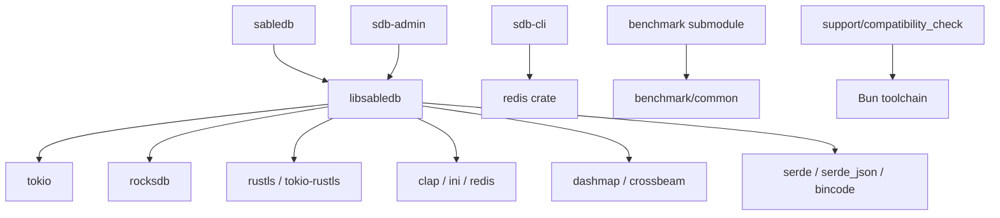

# Dependencies

## Core Rust ecosystem dependencies
- `tokio`: async runtime used by the core library and server-related code.
- `clap`: command-line parsing for server, client, and admin binaries.
- `tracing` and `tracing-subscriber`: structured logging and log filtering.
- `bytes`: byte buffers used in command execution and RESP handling.
- `serde` and `serde_json`: structured serialization support.
- `thiserror`: error modeling.
- `async-trait`: async trait support.
- `lazy_static`: shared runtime helpers.

## Storage and database dependencies
- `rocksdb`: primary storage engine integration.
- `sled`: additional storage-related dependency present in the core crate.
- `bincode`: serialization used for internal data exchange.
- `crc16`: checksum / slot-related utility support.

## Networking and security dependencies
- `redis`: client protocol support used by the CLI.
- `rustls`, `tokio-rustls`, `rustls-pemfile`, `rustls-pki-types`: TLS support.
- `ctrlc`: process interruption handling.

## Concurrency and collections
- `dashmap`, `crossbeam`, `crossbeam-skiplist`, `rclite`, `nohash-hasher`: concurrent data structures and performance-oriented collections.
- `core_affinity`, `affinity`: CPU affinity support on selected targets.

## Parsing, formatting, and utility crates
- `ini`: configuration file parsing.
- `strum`, `strum_macros`, `enum-iterator`: enum utilities.
- `wildmatch`: pattern matching support.
- `num-traits`, `num-format`: numeric helpers.
- `uuid`: identifier generation.
- `flate2`, `tar`: compression and archive support.
- `hdrhistogram`: metrics/latency histogram support.

## Tooling and build dependencies
- Workspace uses Rust 2021 edition.
- Build scripts are present in several crates.
- GitHub Actions workflow runs build, clippy, and tests on Ubuntu.
- Windows usage expects MSYS2 and specific Clang/Rust toolchain packages, as documented in the repository README.

## Submodule and auxiliary tooling dependencies
- `submodules/benchmark`: separate benchmark workspace with shared utilities and benchmark binary.
- `support/compatibility_check`: Bun-based compatibility analysis tooling for command metadata.
- Markdown-based operational docs in `docs/` and `support/`.

## Dependency map

## Notes
- The repository is dependency-heavy and uses several ecosystem crates to compose storage, protocol, and replication behavior.
- Some dependencies are present in manifests but their exact usage should be confirmed in the corresponding source modules when making changes.
