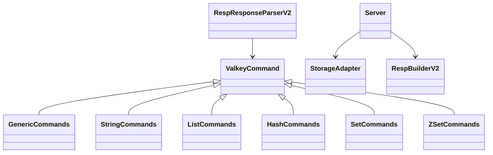
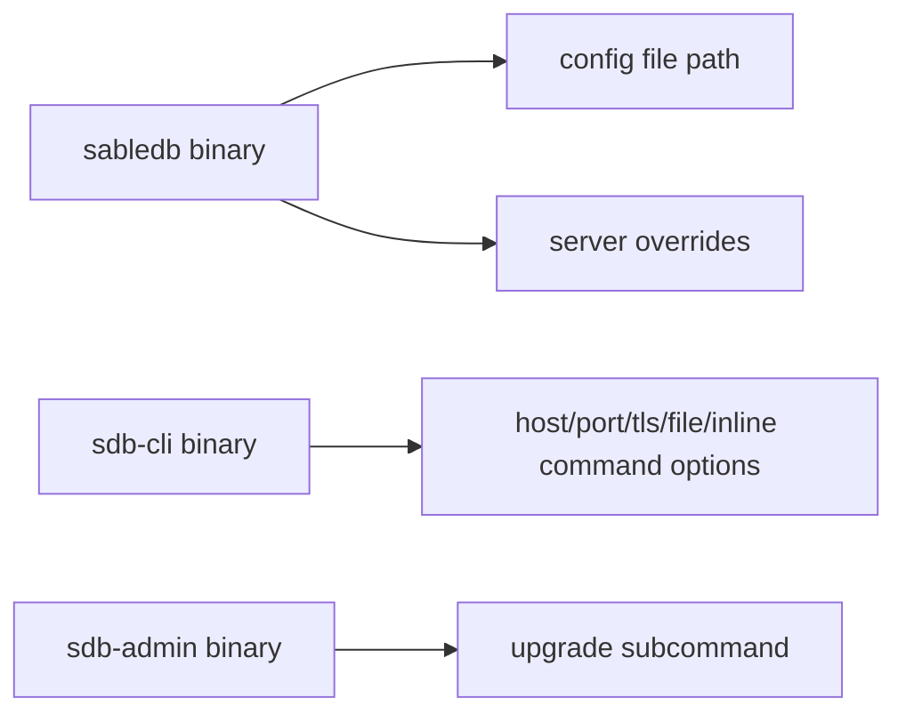

# Interfaces

## Public library surface
`libsabledb/src/lib.rs` re-exports the main API used by binaries and external callers.

### Key exported categories
- Command traits and command families
- Metadata models
- Transport abstraction
- Server types and worker coordination types
- Storage adapter and RocksDB-backed storage
- RESP builder/parser helpers
- Utility modules

## Binary entry points

### `sabledb`
- Parses command-line and configuration file input.
- Applies overrides to `ServerOptions`.
- Configures tracing/logging.
- Opens storage and starts the listener loop.
- Dispatches accepted connections to workers.

### `sdb-cli`
- Parses CLI options.
- Builds a Redis/Valkey connection string.
- Supports interactive REPL mode and batch execution from files or inline parameters.
- Pretty-prints RESP responses.

### `sdb-admin`
- Parses admin subcommands.
- Currently exposes upgrade functionality.

## Configuration interface
- `ServerOptions::from_config` reads INI files.
- `CommandLineArgs` applies CLI overrides.
- `ServerOptions::use_tls` determines whether TLS is enabled.

### Important configuration areas
- General server addresses and logging
- Storage open parameters
- Replication limits
- Client limits
- Cron settings

## Network and protocol interface
- Client communication is compatible with the Redis/Valkey protocol.
- Socket preparation is handled by transport utilities that adjust blocking mode, timeouts, and TCP delay.
- RESP parsing and response generation are exposed through reusable I/O helpers.

## Key integration points
- TCP listener in the server binary feeds sockets to worker threads.
- CLI client connects via `redis::Client` using `redis://` or `rediss://` URLs.
- Replication components exchange custom node-talk requests and responses.
- Storage adapter wraps the persistence backend and is used by command execution and replication.

## Command-line interface shape

## Guidance on using interfaces
- Use `lib.rs` when you need the canonical names of exported types.
- Use `server_options.rs` when you need to know which runtime parameters can be configured.
- Use `sdb-cli` when you need to understand how commands are sent and responses are formatted.
- Use `replication::mod` when you need node-to-node message types and socket helpers.
