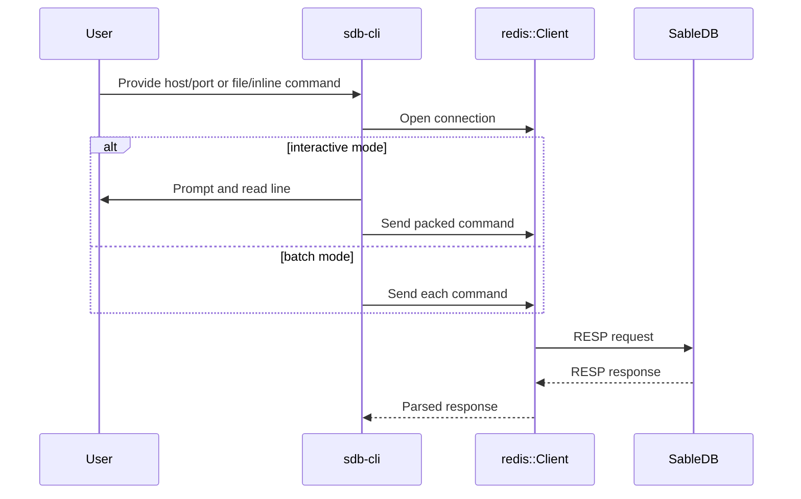
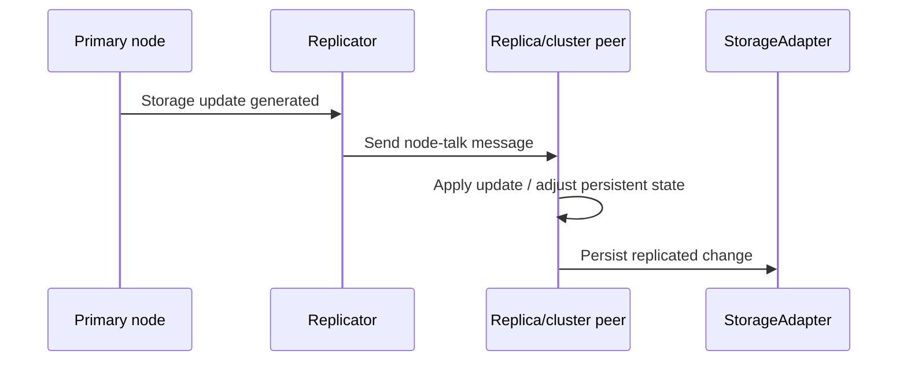

# Workflows

## Server startup workflow
```mermaid
sequenceDiagram
    participant Main as sabledb main
    participant Args as CommandLineArgs
    participant Opt as ServerOptions
    participant Store as StorageAdapter
    participant Srv as Server
    participant Net as TcpListener
    participant Rep as Replication state

    Main->>Args: Parse CLI
    Main->>Opt: Load config / apply overrides
    Main->>Store: Open storage
    Main->>Srv: Create server with options + storage
    Main->>Net: Bind listener
    Main->>Rep: Load persistent state
    Main->>Rep: Initialize replication
    Main->>Net: Accept connections
```

Startup behavior:
1. Parse CLI arguments.
2. Load optional config file.
3. Apply command-line overrides.
4. Initialize logging.
5. Open storage.
6. Create server and worker pool.
7. Bind the TCP listener.
8. Load persistent node state.
9. Initialize replication coordination.
10. Accept and dispatch client connections.

## Client command workflow (`sdb-cli`)


## Command execution workflow
- The client packages commands into RESP-compatible wire messages.
- The server accepts a socket and hands it to a worker.
- The worker delegates to command handlers.
- Command handlers validate arguments and operate on storage/metadata.
- Responses are encoded back to RESP and returned to the client.

## Storage workflow
- Commands route through the storage adapter rather than interacting with RocksDB directly.
- Type-specific storage modules implement operations for strings, hashes, lists, sets, locks, and sorted sets.
- Write caching and batch updates are used to optimize persistence.
- Maintenance tasks may scan, evict, or compact data according to cron settings.

## Replication workflow


Replication-related behavior:
- A node may restore replica mode from persistent state.
- Cluster and shard state are maintained separately from transient command execution.
- Storage updates are serialized and exchanged over the replication channel.

## Maintenance and cron workflow
- Cron settings control eviction, scanning, and compaction timings.
- Orphan records are identified and removed by background work.
- Cluster database status may be updated periodically when in replicated or clustered mode.

## Operational workflow guidance
- If you are debugging connection issues, follow the startup and command-execution workflow first.
- If you are debugging stale data or missing keys, follow the storage workflow and maintenance settings.
- If you are debugging cluster divergence, follow the replication workflow and persistent state path.
